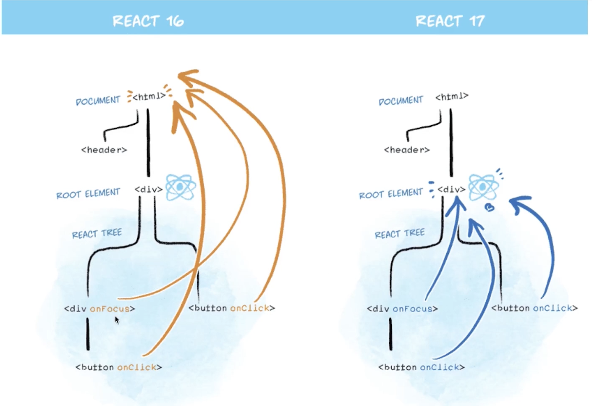

# Event

## Bind this

Bind "this" 

```jsx
this.clickHandler = this.clickHandler.bind(this);
```

 arrow function will not create "this" for itself.

- event

```jsx
clickHandler = evernt => {
  event.preventDefault(); 
  event.stopPropagation();
}
```

- arg.

```jsx
onClick={this.clickHandler.bind(this, arg1, arg2)}
```



## Event arg.

