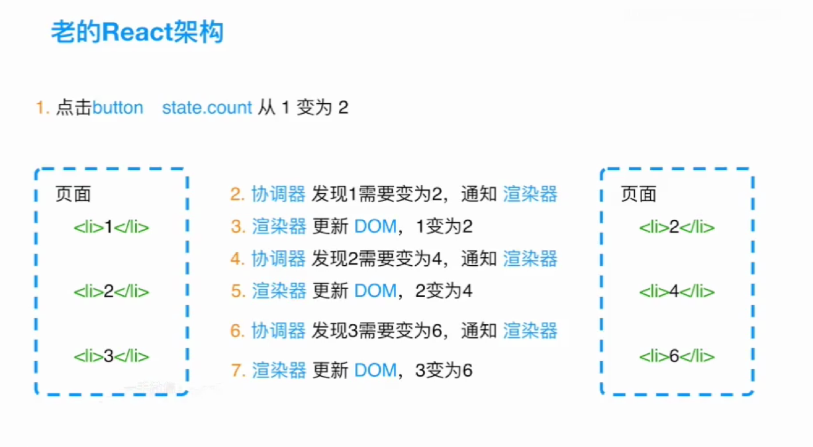
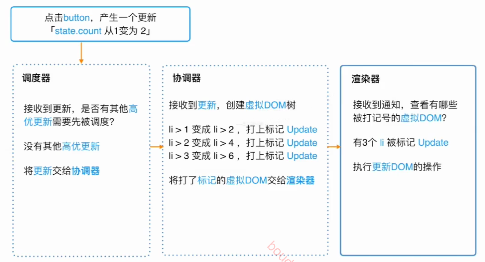

# React 设计理念

## 快速响应

### 制约因素

1. 计算能力 （CPU）
2. 网络延迟 （IO）

JS脚本执行 - 样式布局 - 样式绘制

浏览器刷新率为 60Hz（ 16.6ms/帧），如果渲染界面时间 > 16.6ms，没有时间进行样式布局和绘制 导致 界面加载不流畅。

（回流与重绘+节流防抖）

### React方法

解决CPU： 同步更新 => 异步可中断更新

解决IO：人机交互

# React架构

## React15

### Reconciler

(differ or reconcile)

### Renderer

ReactDOM渲染器，(浏览器，SSR)
ReactNative渲染器，(渲染App原生组件)
ReactTest渲染器，(渲染JS对象)
ReactArt渲染器，(canvas SVG)

老架构无法同步更新

## React16

### scheduler

### Fiber架构

践行代数效应：将副作用从函数调用中分离 (hooks)

中断-恢复

Fiber(纤程)

- 进程( Process)
- 线程(Thread)
- 协程(Coroutine) Generator 

1. generator有传染性

2. 更新可以中断恢复，并且拥有优先级

   #### Fiber架构工作原理

   Fiber含义：

   1. 架构上，
      1. stack-reconciler: React15 Reconciler采用递归来执行，数据保存在递归的调用栈中。
      2. 基于fiber实现
   2. 静态数据结构 （虚拟DOM）
      1. ReactDOM.render() => FiberRootNode-RootFiber
   3. 动态工作单元

   双缓存

# React实现

